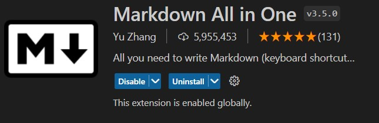
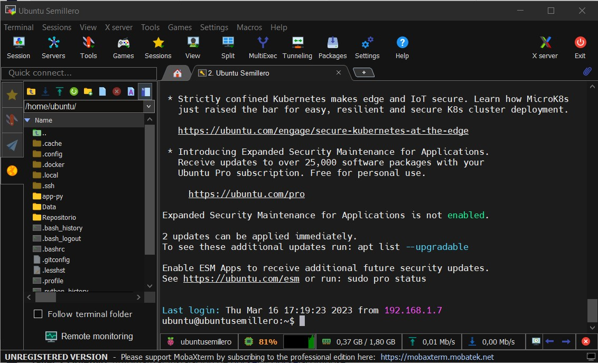
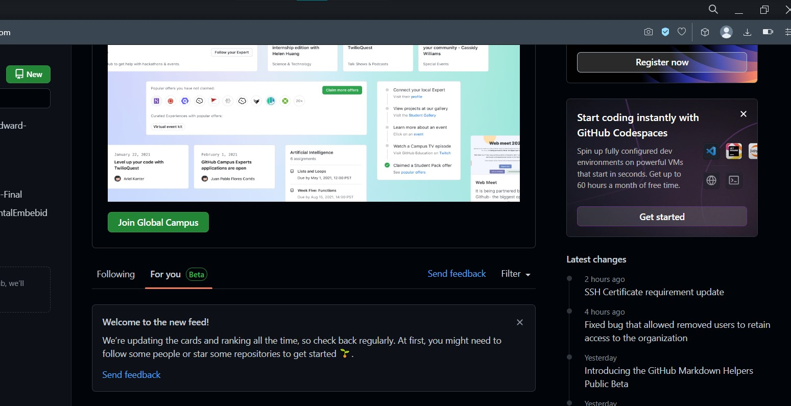
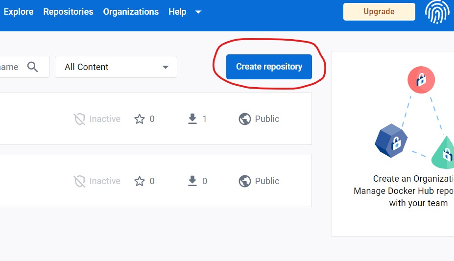
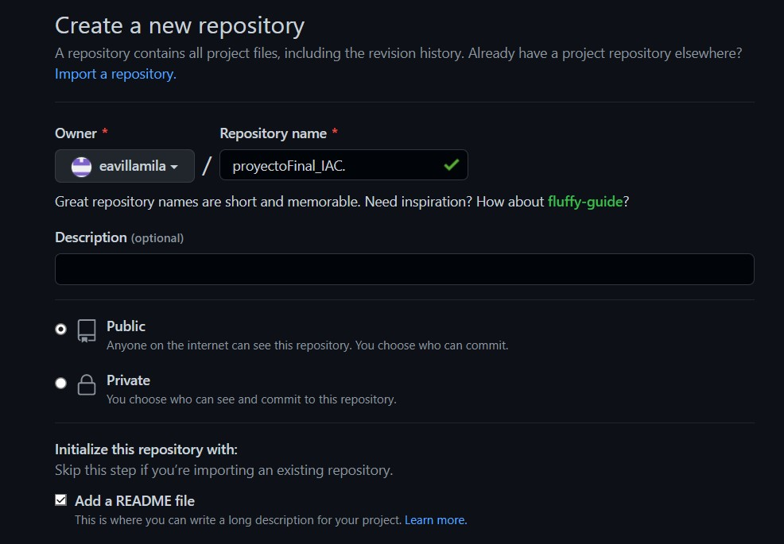
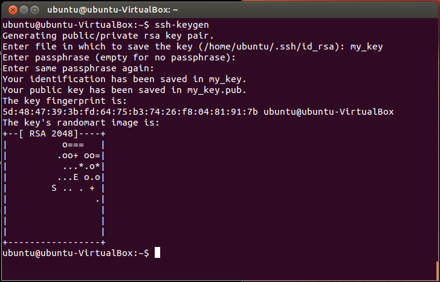
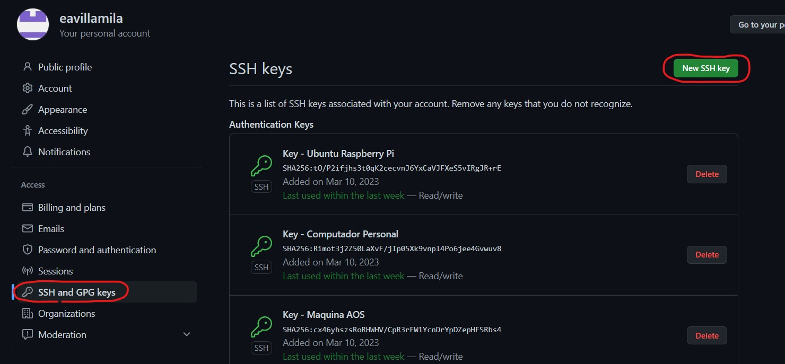

# **Módulo Docker - Semillero DevOps**

## **Taller 1**

### ***1. Entorno de Desarrollo***

Para el desarrollo de cada una de los items del presente trabajo, se emplearon las siguientes herramientas y definiciones:

- *[Visual Studio Code](https://code.visualstudio.com)* <br>
  Desde este editor se realizó toda la construcción de la presente documentación, así como la preparación y revisión de los archivos necesarios para la construcción de nuestros contenedores Docker.
  Dentro de Visual Studio Code empleamos una extensión que complementa las herramientas disponibles para la edición, previsualización y y organización de nuestros archivos *".md"*, como nuestro README. Esta extensión fue *Markdown All in One*.
  <div align="center">
    
  </div>
- *[MobaXterm](https://mobaxterm.mobatek.net)* <br>
  Está herramienta es una terminal mejorada para windows. En general nos permite ampliar las funcionalidades que tenemos disponibles desde la consola. La empleamos para nuestra comunicación SSH con nuestro servidor.
  <div align="center">
    
  </div>
- *Definiciones* <br>
  Previo a la realización de cualquier proyecto de desarrollo es importante hacer al menos las siguientes definiciones:
  
    |      **Aspecto o Item**     	|   **Definición**  	|
    |:---------------------------:	|:-----------------:	|
    |    Nombre del Repositorio   	| proyectoFinal_IAC 	|
    |  Esquema de Versionamiento  	|     TrunkBase     	|
    |   Nomenclatura de los Tags  	|        v1.0       	|
    | Nomenclatura de los Commits 	|       RF1546      	|

### **2. Cuenta GitHub**
Para el desarrollo de este taller fue necesario disponer de una cuenta en GitHub para el control de versiones. Para la creación de este recurso solo es necesario ingresar a [https://github.com/signup?source=login](https://github.com/signup?source=login) y seguir los pasos inidcados ingresando la información correspondiente y realizando la verificación del correo electrónico. <br>
Tras esto, podemos ingresar a [github.com/login](github.com/login), iniciar sesión y nos encontraremos con una ventana como la siguiente:
<div align="center">
  
</div>

### **3. Cuenta Docker Hub**
También vamos a requerir de una cuenta de Docker Hub, ya que vamos a constrir un repositorio donde alojaremos las imagenes Docker que construyamos. Para eso ingresamos a [https://hub.docker.com/signup](https://hub.docker.com/signup), ingresamos los datos correspondientes, validamos nuestro correo e iniciamos sesión. <br>
*Recomendación:* Se creativo con tú nombre de usuario, ya que se trata del mecanismo con el que identificarás todos tus repositorios. <br>


### **4. Repositorios**
Puedes crear un repositorio en Docker Hub para alojar la imagen que construiremos más adelante, pero también puedes esperar y hacerlo de manera directa desde la consola de comandos. Para crearlo solo debes dar click en ``Create Repository`` en la parte superior derecha de la página de inicio. Con una cuenta Free solo podrás crear un repositorio privado, pero nosotros trabajaremos sobre uno privado.
<div align="center">
  
</div>
Sin embargo, si necesitamos crear ya nuestro repositorio en GitHub, para lo cual damos click en ``New`` sobre la lista de repositorios en la ventana de inicio en la parte superior izquierda. Ya conoces el nombre que debe llevar, solo no olvides configurar que sea público y agregar el archivo ``README.md``.

<div align="center">
  
</div>

<div align="center">
  
</div>

### **5. Configuración SSH**
La forma que emplearemos para realizar las copia del repositorio en nuestro servidor y computador personal, así como la actualización de este último con los cambios que se realicen, es a través de SSH, para creamos un par de llaves en los dispostivos que vamos a usar para traer y llevar información a GitHub (servidor y equipo personal) a través del terminal con el comando ``ssh key-gen``. Para evitar dificultades con la conexión, no empleamos un passphrase, solo damos enter en estos campos.

<div align="center">
  
</div>

Luego, nos dirigimos a la carpeta ``~/.ssh``, donde encontraremos dos archivos con los nombre ``id_rsa`` y ``id_rsa.pub``. Copiamos el contenido de ``id_rsa.pub``, que nuestra llave púbica y vamos a las congiguraciones (settings) de GitHUb en el icono de nuestro perfil (esquina superior derecha), y buscamos la opción ``SSH y GPG keys`` en la lista de opciones al lado izquierdo de la ventana. Ahí damos click en ``New SSH key``, damos un nombre a la llave y pegamos el contenido en el campo ``key``. Por último, damos clic en ``Add SSH Key`` y listo.

<div align="center">
  
</div>

------------------------------------
## **Taller 2**

### ***1. Instalación de Docker (Menú de Administración)***

Para el proceso de instalación de Docker se creo un nuevo campo en el menú de administración que puedes encontrar en el repositorio ``eavillamil/semilleroDevOps`` o en el siguiente enlace: <br>
[https://github.com/eavillamila/semilleroDevOps/blob/main/taller_so_2/managementMenu.sh](https://github.com/eavillamila/semilleroDevOps/blob/main/taller_so_2/managementMenu.sh).

La opción para este proceso es la "8". Primero se pregunta al usuario si desea instalar Docker, y luego realiza el proceso teniendo en cuenta la configuración de llave y la adición del correspondiente repositorio. Después, configura el usuario "docker", crea su folder e inicia el servicio. La opción incluye también la instalación de Docker Compose, por lo que posterior a este proceso pregunta al usuario si desea realizarla. El código construido se muestra a continuación:

``` bash
clear
echo -e 'Proceso de instalacion de Docker CE...\n'
read -p '¿Desea Instalar Docker? (y/n): ' answer

if [[ $answer =~ ^[Yy]$ ]]
    then
        ###############################################################
        ## Instalación de Docker
        cd ~/
        echo -e '\nRealizando la instalación de los prerrequisitios y las configuraciones necesarias...\n'
        sudo apt-get update
        sudo apt install apt-transport-https ca-certificates curl software-properties-common -y
        # curl -fsSL https://download.docker.com/linux/ubuntu/gpg | sudo apt-key add -
        # El comando anterior no funcionó en Raspberry Pi - Se encuentra la solución con los siguientes comandos:
        curl -fsSL https://download.docker.com/linux/ubuntu/gpg | gpg --dearmor | sudo tee /usr/share/keyrings/docker-ce-archive-keyring.gpg > /dev/null
        echo "deb [arch=$(dpkg --print-architecture) signed-by=/usr/share/keyrings/docker-ce-archive-keyring.gpg] https://download.docker.com/linux/ubuntu $(lsb_release -cs) stable" | sudo tee /etc/apt/sources.list.d/docker-ce.list > /dev/null
        sudo add-apt-repository "deb [arch=amd64] https://download.docker.com/linux/ubuntu focal stable" -y
        echo -e '\nRealizando instalación de Docker...\n'
        sudo apt update
        apt-cache policy docker-ce
        sudo apt install docker-ce -y

        echo -e '\nPresiona ENTER para continuar...'
        read -p ''

        clear
        echo 'Proceso de instalación completado.'
        echo -e '\nVerificando la versión de Docker instalada ...\n'
        docker --version
        
        echo -e '\nPresiona ENTER para continuar...'
        read -p ''
        
        clear
        echo -e '\nCreando y configurando el usuario Docker...\n'

        user=docker
        # Si hay algún conflicto con la creación del usuario Docker, se debe editar el archivo /etc/group
        # borrando las líneas que contienen ese usuario o grupo.
        sudo adduser $user
        sudo usermod -a -G docker $user
        grep $user /etc/group

        echo -e '\nConfigurando el usuario actual en el grupo Docker...\n'

        user=$(whoami)
        sudo usermod -a -G docker $user
        grep $user /etc/group

        echo -e '\nVerificando creación del folder docker y ortorgando permisos...\n'
        folder=/home/
        sudo mkdir -p $folder/$user
        sudo mkdir -p $folder/$user/Data
        sudo chown -R $user:$user $folder/$user
        sudo chown -R $user:$user $folder/$user/Data
        ls -ltr $folder/

        echo 'Usuario Docker listo.'
        echo -e '\nPresiona ENTER para continuar...'
        read -p ''

        clear
        echo -e 'Iniciando docker en el sistema...\n'
        sudo systemctl enable docker
        sudo systemctl start docker

        echo -e '\nServicio Docker disponible...'
        echo -e '\nPresiona ENTER para continuar...'
        read -p ''

        clear
        echo -e 'Proceso de instalacion de Docker Compose...\n'
        read -p '¿Desea Instalar Docker Componese? (y/n): ' answer

        if [[ $answer =~ ^[Yy]$ ]]
            then
            ###############################################################
            ## Instalación de Docker Compose

            echo -e '\nIniciando la instalacion de Docker Compose...\n'

            sudo mkdir -p /usr/local/bin
            # El siguiente comando fue cambiado porque fallo para Raspberry Pi.
            # Se adiciona una "v" a la versión en la URL y se actualiza la versión descargada.
            # sudo curl -L "https://github.com/docker/compose/releases/download/1.26.2/docker-compose-$(uname -s)-$(uname -m)" -o /usr/local/bin/docker-compose
            sudo curl -L "https://github.com/docker/compose/releases/download/v2.16.0/docker-compose-$(uname -s)-$(uname -m)" -o /usr/local/bin/docker-compose

            sudo chmod +x /usr/local/bin/docker-compose

            clear
            echo -e '\nVerificando la versión de docker-compose...\n'
            sudo docker-compose --version

            echo -e '\nDocker Compose está instalado.\n'
        fi
fi

echo -e '\nPresiona ENTER para regresar al menú...'
read -p ''

unset answer
unset user
unset folder
clear
```

### ***2. Actualización del Repositorio***
Para la actualización del repositorio se hará uso del Shell Script [pushGit.sh](https://github.com/eavillamila/semilleroDevOps/blob/main/shells_git/pushGit.sh). El código de este archivo es el siguiente:

``` bash
#!/bin/bash

echo -e 'A continuación, se muestra el estado del repositorio local: \n'
git status
echo -e '\nPresiona ENTER para continuar...'
read -p ''

clear
echo -e 'Se agregan los archivos al entorno de prueba...\n'
git add .
echo -e '\nPresiona ENTER para continuar...'
read -p ''

clear
echo -e 'A continuación, se muestran las dos últimas confirmaciones (commits) del repositorio: '
echo -e '\e[0;34m' "$(git log -2)" '\e[m'
echo -e '\nSe realiza la confirmación (commit) del repositorio...\n'
read -p 'Ingresa el comentario (Sugerencia - En la forma "#Comment"): ' comment
git commit -m "$comment"
echo -e '\nPresiona ENTER para continuar...'
read -p ''

clear
echo -e 'Se realiza el push hacia el repositorio remoto...\n'
echo -e '\nRamas disponibles:'
git branch -r
echo -e '\n'
read -p 'Ingresa el nombre de la rama: ' rama
git push origin "$rama"
echo -e '\nPresiona ENTER para continuar...'
read -p ''

git status
echo -e '\nPresiona ENTER para continuar...'
read -p ''

clear
unset comment
unset rama
```

### ***3. Copia del Repositorio***
Para hacer el git clone del repositorio se hará uso del Shell Script [startGit.sh](https://github.com/eavillamila/semilleroDevOps/blob/main/shells_git/startGit.sh). El código de este archivo es el siguiente:

``` bash
#!/bin/bash

clear
read -p '¿Deseas clonar un repositorio? (y/n): ' option1
if [ $option1 = y ] || [ $option1 = Y ]; then
    read -p 'Escribe la URL HTTPS o SSH para clonar el repositorio: ' url
    git clone $url
    echo -e '\nPresiona ENTER para continuar...'
    read -p ''
    clear
fi

url="$(echo "${url##*/}")"
cd "$(echo "${url%.*}")"
read -p '¿Deseas realizar las configuraciones iniciales del repositorio? (y/n): ' option1
if [ $option1 = y ] || [ $option1 = Y ]; then
    echo -e 'Configuración básica del repositorio...\n'
    read -p 'Ingresa el nombre de usuario: ' user
    read -p 'Ingresa el correo GitHub del usuario: ' email

    git config --global user.name $user
    git config --global user.email $email
    git config --global core.autocrlf false
    clear

    read -p '¿Quieres desactivar la validación de los certificados SSL? (y/n): ' option1
    if [ $option1 = y ] || [ $option1 = Y ]; then
        git config --global http.sslVerify false
    fi
fi

echo -e 'A continuación, se muestra el estado actual del repositorio local y las ramas disponible:\n'
git status
echo -e '\nRamas disponibles: '
git branch -r

echo -e '\n'
read -p '¿Quieres cambiar de rama? (y/n): ' option1
if [ $option1 = y ] || [ $option1 = Y ]; then
    read -p 'Ingresa el nombre de la rama: ' rama
    git checkout $rama
fi

clear
unset option1
unset url
unset rama
unset user
unset rama
```

### ***4. Instalación de la Shell***
Las shell se descargaron en el servidor a través de otro repositorio donde se estaban dispuestos estos archivos. En link es el siguiente:

[https://github.com/eavillamila/semilleroDevOps](https://github.com/eavillamila/semilleroDevOps)

### ***5. Pruebas de Instalación***
La instalación de Docker y Docker Compose se puede verificar a través de los siguientes comandos:

``` bash
docker --version
sudo service docker status
```

``` bash
docker-compose --version
```

------------------------------------
## **Taller 3**

### ***1. Construcción del Contenedor Docker***

### ***2. Pruebas de Funcionamiento***

### ***3. Repositorio Docker Hub***